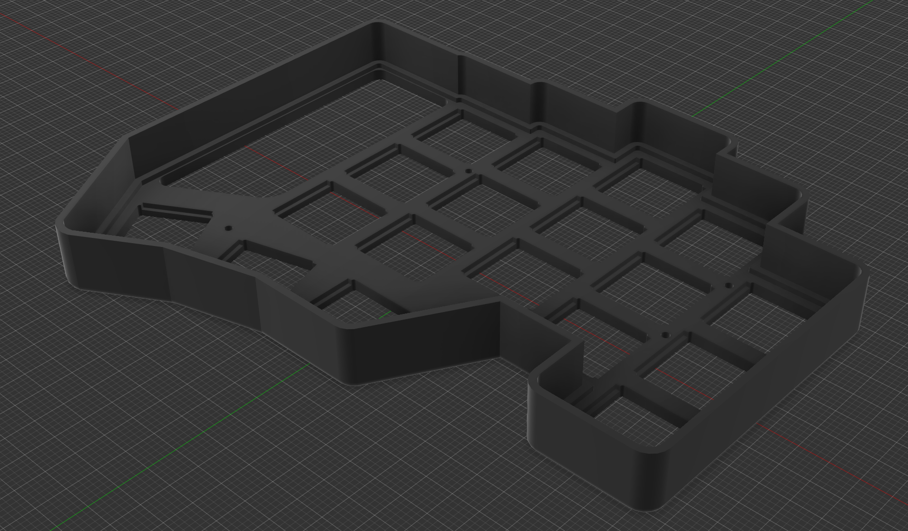
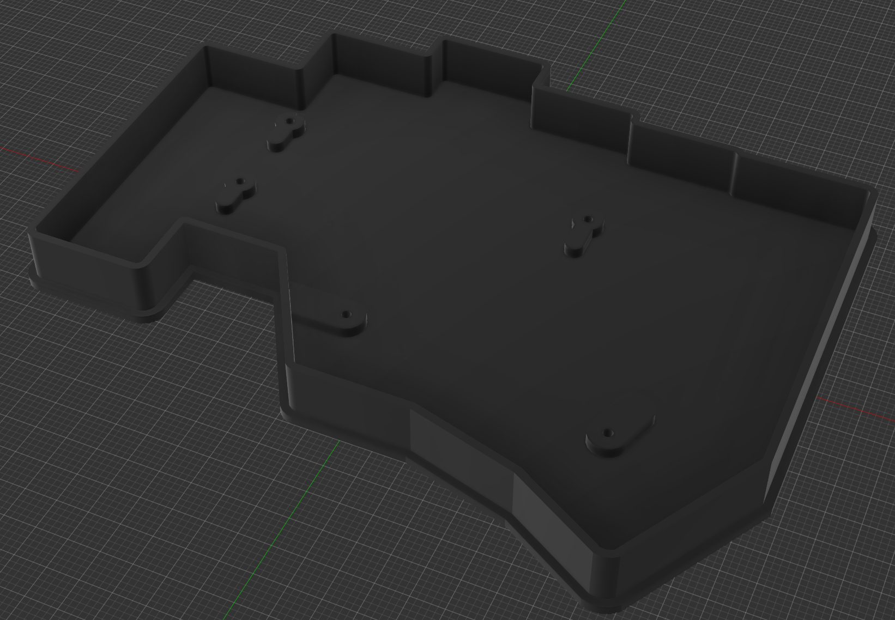
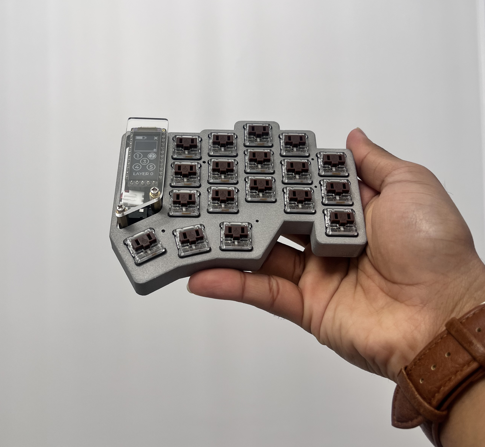
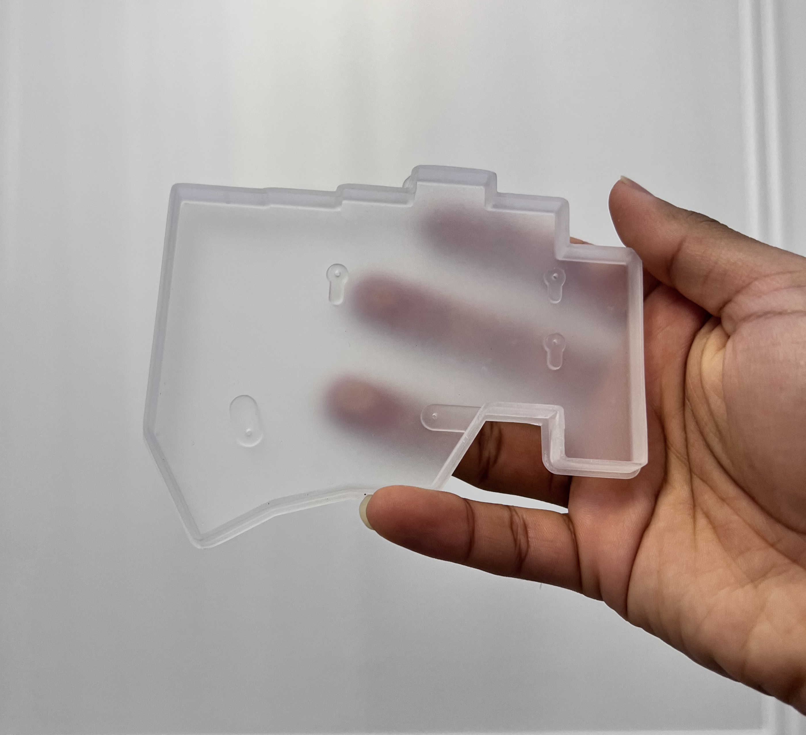

# chocJwd: A wearable split mechanical keyboard project

## Overview

I started this project as a gateway to simple custom mechanical keyboard but it very quickly evolved into something that I use everyday and specially, it solves a few real-world problem I was facing.
Introducing chocJwd, a custom mechanical keyboard and accessories project that features a pair of detachable armrest and a pair of strapping mechanism (more on that soon).

## The case

  

### Modifications
I’m using the [chocofi case](https://github.com/pashutk/chocofi/tree/main/case/v1), but I modified it to be slightly taller. This gives me enough room inside for some sound‑enhancing tweaks (to make it really “thock”). Who says custom ergonomic split keyboards can’t sound great, right?
Since I plan to use the keyboard with tenting, I don’t mind if it isn’t ultra low‑profile. I’m happy to trade a bit of _low‑profile_ for better typing sound. It’s still slimmer than a traditional keyboard though.

  

### 3D-printing

  

Who doesn’t love an aluminium case for their keyboard? But CNC machining can be very expensive, but there’s an easier (and cheaper) way to get a metal case—3D printing.

I got my case printed at [PCBWay](https://www.pcbway.com/). Top shell in Aluminium (AlSi10Mg) and the base in transparent UTR-8100 resin with a matte finish. For me, Resin is perfect for the bottom since it’s mostly hidden—and I’ve got a steel plate and some sound-dampening inside anyway.

  

This hybrid approach can cut the cost by **50%!** This may seem obvious, but I haven't seen many people talking about this approach. If you care mostly about the look (and, to some extent, the feel) of aluminium, try printing just part of the case in aluminium if you are on a budget.

If you’d like to try this yourself, grab the STL files from [/case](./case), then visit PCBWay’s [3D Printing page](https://www.pcbway.com/rapid-prototyping/manufacture/?type=2), drag and drop your files, choose quantity and material. You can leave the rest at default. My prints came out excellent, and I’m very happy with the results.

> Disclaimer: PCBWay sponsored these cases, but they didn’t tell me what to say—this is 100% my own experience.  

# I'll be adding more details very soon
