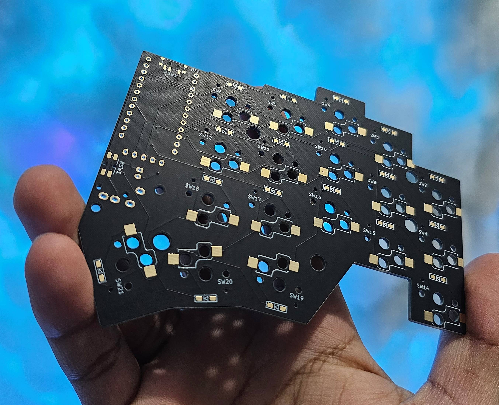

# chocJwd: A wearable split mechanical keyboard project

## Overview

This project started as a gateway to simple custom mechanical keyboard but it very quickly evolved into something that I use everyday and specially, it solves a few real-world problem I was facing.
Introducing chocJwd, a custom mechanical keyboard and accessories project that features a pair of detachable armrest and a pair of strapping mechanism.

## The keyboard

### PCB

I'm using the [chocofi](https://github.com/pashutk/chocofi) pcb but it is the modified version by [beekeeb](https://github.com/beekeeb) which allows the use of [nice!nano](https://nicekeyboards.com/docs/nice-nano/) micro controller and [nice!view](https://nicekeyboards.com/docs/nice-view/) OLED screen.

#### Soldering

All the components such as diodes, hot swat sockets (for the keys), the power buttons, reset buttons, jst batter connector had to be soldered.

##### Diodes

Diodes were the smallest component in this project. However, I found it to be the easiest to solder. I started by adding a little bit of flux and a little blob of solder and placed one end of the diode and pressed down using the soldering iron. Afterwards I put a little bit of solder on the tip of my soldering iron and again, pressed down to finish the solder.

  

However, I did make some mistakes sometimes - soldering it the wrong way as you can see in the example above. In such situation I tried desoldering using solder wick but I couldn't manage to desolder so I used the trusty soldering iron to heat up the solder until it came lose and fixed the orientation of the diode.

  

